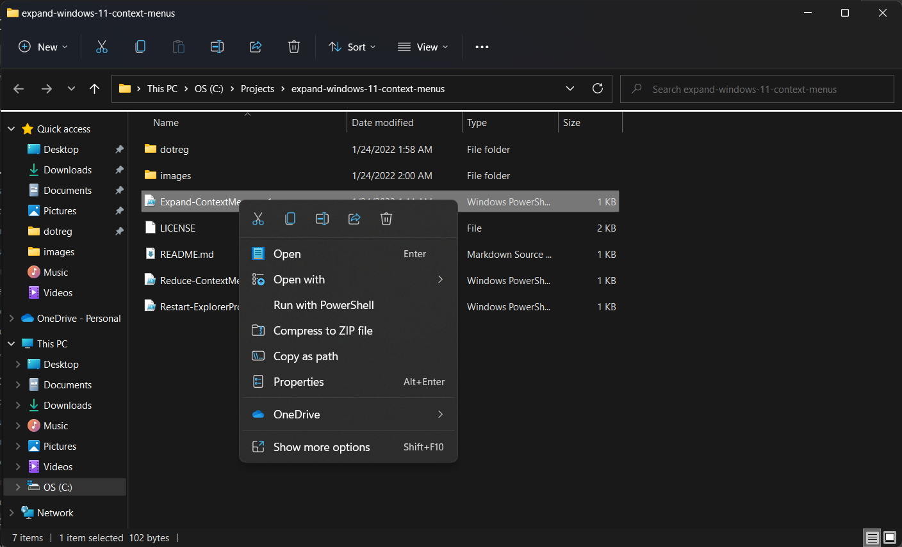
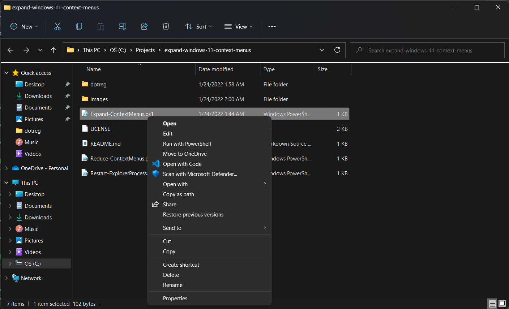

# Expand Windows 11 Context Menus
A repository of tools to re-enable *full* context (aka: right-click) menus in Windows 11.

Go from this:

to this:

Run the Expand-ContextMenus.ps1 script
OR
Double-click the dotreg\Expand-ContextMenus.reg to import the necessary registry settings. (Note: When importing the .reg file, you'll need to appove/confirm a warning message [like this](./images/import-warning.png) about importing unknown scripts.)

Either option that you use above, you'll need to follow it with running the Restart-ExplorerProcess.ps1 script to get the change to show up.

If you'd like to go back to the Windows 11 default (condensed) context menus simply run the Reduce-ContextMenus.ps1 script or import the dotreg\Reduce-ContextMenus.reg. This change takes effect immediately (without explorer restart).

If you found this helpful, please share it with your friends who might also find it helpful... and consider [buying me a coffee](https://www.buymeacoffee.com/bradlinard) if you like. :D GBU